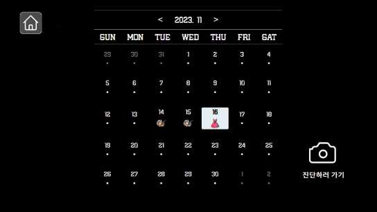
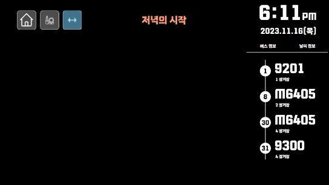
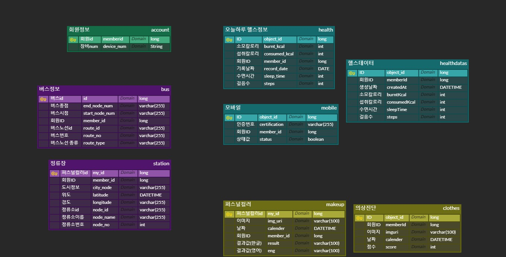

# 🏃‍♂️💄 나만의 라이프, 스마트 미러 AIOT 서비스, 'SSTUDE HOUSE' 


```
📢 SSFAY 9기 2학기 자율프로젝트
📢 구미2반 D204
📢 23.10.10~ 23.11.24 (총 6주)
```

<br/>

---

# 🔍1. SSTUDE HOUSE 소개

## **🔖 생활밀착형 스마트미러 서비스**

        실생활 기기인 거울에서 일상에 필요한 생활 밀착형  스마트 미러 서비스 'SSTUDE HOUSE'


<br/>

---

<br/>

# 🔍 2. 주요 기능

### - 얼굴인식 회원가입 / 로그인
  
  

### - BUS 정보

  .gif)

### - 날씨 정보
  
  .gif)

### - 퍼스널컬러 진단
  
  

### - 의상진단
  
  


### - 삼성 헬스정보 확인
  

### - 삼성 헬스연동 모바일 앱


---

# 🔍3. 개발 환경

## 3-1. 환경설정

### 📱 **Mobile**


### 📟 **Frontend**


### 📟 **Embedded**


<br/>

### 💻 **Backend**


### ⚙ **CI/CD**


### ⚙ **Communication**


## 3-2. 서비스 아키텍쳐

### 💻 **Backend**


<br/>

---

## 3-1. ERD

  


<br/>

---

<br/>

# 👩‍👦‍👦5. 팀 소개


| 최혜원    | 서지호    | 안솔비 | 강민석   | 김수찬  | 전수림  |
| ------ | ------ | --- | ------ | ---------------------------------- | ------ |
| Backend | Frontend(Leader) | Frontend  | Frontend | Backend | Backend |                                                |


